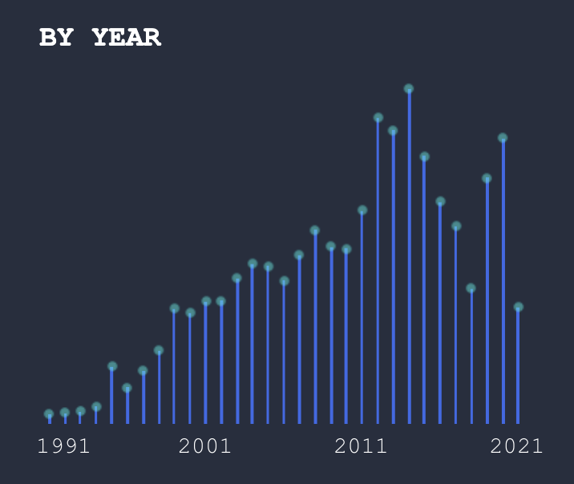
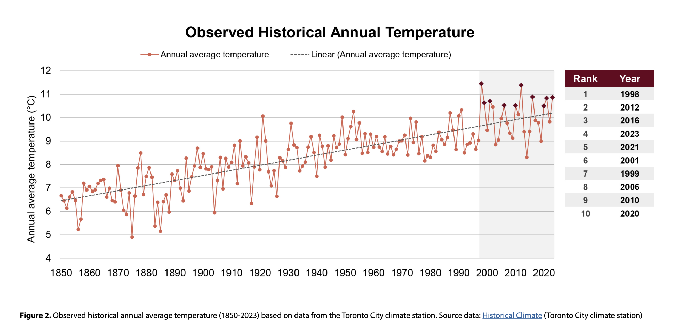

# Data Visualization

## Assignment 2: Good and Bad Data Visualization

### Requirements:

- Data visualizations are important tools for communication and convincing; we need to be able to evaluate the ways that data are presented in visual form to be critical consumers of information 
- To test your evaluation skills, locate two public data visualizations online, one good and one bad  
    - You can find data visualizations at https://public.tableau.com/app/discover or https://datavizproject.com/, or anywhere else you like! 
- For each visualization (good and bad):  
    - Explain (with reference to material covered up to date, along with readings and other scholarly sources, as needed) why you classified that visualization the way you did.


      ```
Bad Data Viz: (Admittedly nonsensical) UFO sightings on Tableau
https://public.tableau.com/app/profile/caroline.swiger/viz/Unidentified30YearsofUFOSightings/Unidentified
Reported UFO Sightings are on the Rise Figure 2: “By Year”



I decided to have some fun with this assignment and chose a data visualization on a topic that I know is outlandish (UFO sightings).  Below are my assessments of this visualization, based on the criteria discussed in class.
The visualization has some nice features:

**Aesthetic**: I do actually think this visualization is pretty.  The colors evoke the night sky, which is a nice touch given the topic.

Additionally, the clean layout, geometric shapes and lines, and 2D image increases perceived the factual basis of this image.  However, the lack of a cited reference at the bottom reduces it.

The choice of a simple bar plot helps minimize the **cognitive load** of this visualization.

However, I think the visualization has several problems:

**Perceptual**: The intended point that UFO sightings are on the rise is not a clear trend across all 30 years.  The numbers increase steadily until the mid-2010s, and then there is a more varied pattern.

**Substantive**: I think the data is presented in a way that can be difficult to understand.  Problems include:
1.	No clear y-axis labels.  If a reader wants to figure out what the y axis scale is, they can hover over the graph to get the information, but having to do so and remember those values increases the cognitive load for this visualization.
2.	I also think the lack of y-axis labels detracts from the credibility of this visualization, especially given that the nearby graphs use completely different y-axis scales.
3.	Reference information is not given.  A single reference is provided at the end of the entire Tableau presentation, but data for each figure would be preferable.  
4.	Recalling the **Gestalt principles**, it would be nice if the figure author used lines or grouping to help make a point.  (For example, encircling or labelling the years where they intend to show a steady upward trend in UFO sightings).  The chart contains no grouping of objects or lines.


Good Data Viz.  Figure 2 on p. 15: https://www.toronto.ca/wp-content/uploads/2024/12/949f-TorontosCurrentandFutureClimate-REPORT-Final.pdf



Below are my assessments of this visualization, based on the criteria discussed in class.

**Aesthetic**: The graph is a little busy, but mostly easy to understand and interpret.  

**Substantive**: Yes, the figure shows clear increase in average temperature over time.

The clean layout, geometric shapes and lines, 2D image, and reference at bottom increase perceived factual basis.

**Perceptual**: I wish the authors had labeled the x-axis on the plot, but it is pretty easy to infer that the x-axis is years, especially given the plots title.  The table on the right side is a nice touch, but adding temperatures to table (in addition to rank and year) would help further illustrate their point.

**Gestalt principles**: The trend line helps illustrate upward trend over time.Grouping of years 2000 to 2020 further emphasizes high temperatures in recent years.  

**Cognitive Load**:  I think the cognitive load of this figure is reasonable.  Line plots are common.  It did take a little extra mental work to figure out that dark diamonds on plot correspond to the top 10 temperatures and are also the points in the table.  Overall, though, this graph makes a clear point very quickly and shows that the average annual temperature in Toronto has been on the rise for over the past ~170 years, as explained in the report text that precedes the figure.


      
      ```
- Word count should not exceed (as a maximum) 500 words for each visualization (i.e. 
300 words for your good example and 500 for your bad example)

### Why am I doing this assignment?:

- This assignment ensures active participation in the course, and assesses the learning outcomes
* Apply general design principles to create accessible and equitable data visualizations
* Use data visualization to tell a story

### Rubric:

| Component               | Scoring   | Requirement                                                 |
|-------------------------|-----------|-------------------------------------------------------------|
| Data viz classification and justification | Complete/Incomplete | - Data viz are clearly classified as good or bad<br />- At least three reasons for each classification are provided<br />- Reasoning is supported by course content or scholarly sources |
| Suggested improvements  | Complete/Incomplete | - At least two suggestions for improvement<br />- Suggestions are supported by course content or scholarly sources |

## Submission Information

🚨 **Please review our [Assignment Submission Guide](https://github.com/UofT-DSI/onboarding/blob/main/onboarding_documents/submissions.md)** 🚨 for detailed instructions on how to format, branch, and submit your work. Following these guidelines is crucial for your submissions to be evaluated correctly.

### Submission Parameters:
* Submission Due Date: `23:59 - 10/26/2025`
* The branch name for your repo should be: `assignment-2`
* What to submit for this assignment:
    * This markdown file (assignment_2.md) should be populated and should be the only change in your pull request.
* What the pull request link should look like for this assignment: `https://github.com/<your_github_username>/visualization/pull/<pr_id>`
    * Open a private window in your browser. Copy and paste the link to your pull request into the address bar. Make sure you can see your pull request properly. This helps the technical facilitator and learning support staff review your submission easily.

Checklist:
- [ ] Create a branch called `assignment-2`.
- [ ] Ensure that the repository is public.
- [ ] Review [the PR description guidelines](https://github.com/UofT-DSI/onboarding/blob/main/onboarding_documents/submissions.md#guidelines-for-pull-request-descriptions) and adhere to them.
- [ ] Verify that the link is accessible in a private browser window.

If you encounter any difficulties or have questions, please don't hesitate to reach out to our team via our Slack. Our Technical Facilitators and Learning Support staff are here to help you navigate any challenges.
