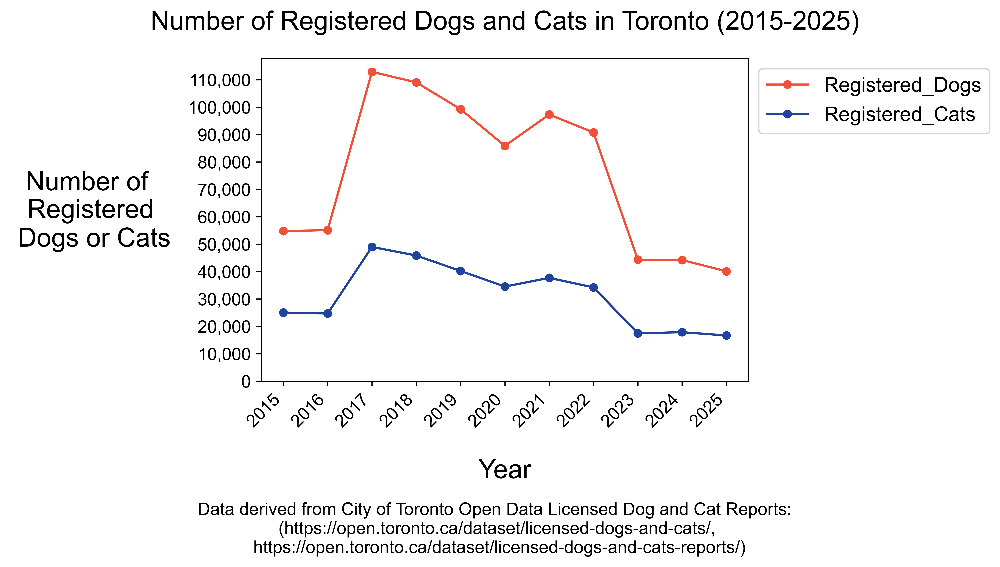
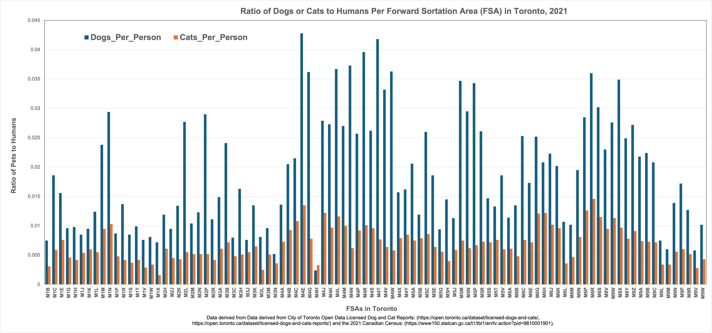

# Data Visualization

## Assignment 3: Final Project

### Requirements:
- We will finish this class by giving you the chance to use what you have learned in a practical context, by creating data visualizations from raw data. 
- Choose a dataset of interest from the [City of Toronto’s Open Data Portal](https://www.toronto.ca/city-government/data-research-maps/open-data/) or [Ontario’s Open Data Catalogue](https://data.ontario.ca/). 
- Using Python and one other data visualization software (Excel or free alternative, Tableau Public, any other tool you prefer), create two distinct visualizations from your dataset of choice.  
- For each visualization, describe and justify: 
    > What software did you use to create your data visualization?

       

    Alt Text for Visualization 1, "Dogs_Cats_Toronto_2015_to_2025.png": Data on numbers of registered cats and dogs in Toronto are plotted for the years 2015 to 2025.  Information on dogs is in blue, and information on cats is in orange.  The values plotted are given in the Table Below:

    **Year** **DOG** **CAT**
    2015	54782	25018
    2016	55121	24701
    2017	112918	48990
    2018	109064	45858
    2019	99276	40230
    2020	85874	34520
    2021	97328	37698
    2022	90780	34222
    2023	44346	17465
    2024	44216	17871
    2025	40101	16673

    Alt Text for Visualization 2, "Pets_Toronto_2021.png": Data are plotted showing dogs per person and cats per person in 2021 for each forward sortation area (FSA) within Toronto.  There are 96 FSAs in total.  Data for dogs is plotted in blue while data for cats is plotted in orange.  Most neighborhoods show a higher ratio of registered dogs per person than cats per person, with the exception of M4H, a region of eastern Toronto containing Thorncliffe Park.  The FSA with the highest overall dogs per person was M4E which contains the Beaches.  Values for pets per person vary between 0.0016 and 0.0146 for cats and 0.0024 and 0.0428 for dogs.

    The visualization "Dogs_Cats_Toronto_2015_to_2025.png" was created using Python and Matplotlib.  The visualization "Pets_Toronto_2021.png" was created using Python and Excel.

    > Who is your intended audience? 
    
    My intended audience is animal enthusiasts and pet owners in Toronto.  I would like to track how many pets have been registered in Toronto over the past 10 years and which neighborhoods / Forward Sortation Areas (FSAs) within Toronto seem particularly pet friendly, based on the ratio of pets to humans.  I was also just a little bit curious to see how the COVID pandemic impacted pet registration, as pet adoptions surged during that time.

    > What information or message are you trying to convey with your visualization? 

    For the first visualization, I am curious to see how pet registration has changed in Toronto throughout the past decade.  That said, I suspect that the fluctuations seen in the graph have more to do with changes in data reporting than actual changes in animal adoption and ownership.  (Data is only available for *registered* pets.  Also, based on the raw files I downloaded, it seems that the methods for data tracking changed throughthe years.).  I was also interested in exploring whether the pandemic years (approximately 2020 to 2021) were correlated with an increase in pet registrations in Toronto, but that trend is not supported by the plot.

    For the second visualization, I was interested in assessing the overall pet preferences and pet friendliness of various regions within Toronto.  I used data from 2021 because this was the year of the most recent census, when population levels per FSA were surveyed.  I am pleased to report that, based on registrations in 2021, we are a **dog** city.  Every forward sortation area (FSA) reported more registered dogs per person than cats per person, with the exception of the weirdos in M4H, a region of eastern Toronto containing Thorncliffe Park.  The FSA with the highest overall dogs per person was M4E which contains, unsurprisingly, the Beaches.

    > What aspects of design did you consider when making your visualization? How did you apply them? With what elements of your plots? 

    The visualizations I prepared are deliberately simplified without excessive text on the plot.  This decision enabled me to present clean, legible graphs that minimize an emotional appeal, lower the **cognitive load** and allow an audience to interpret the data for themselves.  I admit that the plots are not overly pretty, but I prefer to prioritize clarity over **aesthetics**.  I invested a great deal of time and thought in wrangling the data prior to plotting, hopefully creating more **substantive** plots.  To increase **perceived factual basis**, I used 2D images, a clean layout, geometric shapes and lines, and included data sources at the bottom of both images.  Regarding **Gestalt Principles**, for the first image, I also chosed to connect each the data with a line to add a sense of continuity.  For the second image, I tried to leave whitespace between the bar plots for each FSA so as to group and enclose the dog and cat data within each FSA.
    
    > How did you ensure that your data visualizations are reproducible? If the tool you used to make your data visualization is not reproducible, how will this impact your data visualization? 

    All the data processing information is available in the enclosed Jupyter notebook "assignment_3_final_code.ipynb", as is the code to create the matplotlib figure.  The excel spreadsheet for the second visualization, "Pets_and_humans_2021.xlsx" is also enclosed.  In general, both plots were kept relatively simple to help ensure that they could be readily re-created.
    
    > How did you ensure that your data visualization is accessible?  

    To ensure accessibility, I used high-contrast, highly saturated colors.  The colors on the first visualization were actually recommended by https://www.datylon.com/blog/data-visualization-for-colorblind-readers.  I also kept the plots relatively clean, and avoided using too much in-plot text to ensure readibility by a screen reader.  I have also prepared alt-text for each visualization (see above).
    
    > Who are the individuals and communities who might be impacted by your visualization?  

    The information on pet registrations per FSA could be helpful to animal lovers determining which neighborhoods in Toronto may be the most pet-friendly.  They could also be used to argue which neighborhoods may need better infrastructure (dog parks, green space, pet supply stores, pet friendly venues) to help residents support their companion animals.  The plot on pet registrations from 2015 to 2025 argues for better and more consistent management of this data.  The pet registrations fluctuate wildly and I suspect that these changes are the result of data recording practices as opposed to wild changes in pet adoption and ownership.  I hope the pet people at city hall pay better attention.  I also expected the data to show an uptick in pet adoption in 2020 and 2021, which it does not.  However, both of my dogs are "pandemic puppies" adopted in these years, and I know first hand that pet adoptions were happening rapidly during this time (However, I was living in this US at that point.  Perhaps things were different in Canada?)
    
    > How did you choose which features of your chosen dataset to include or exclude from your visualization? 

    Notably, for both visualizations, I deliberately omitted registration data from FSAs that were not available in every year.  (In some years, more parts of the Greater Toronto area were surveyed than others).  This choice enabled more confidence that the observed trends are not the result of changes in how many regions were surveyed.  The second visualization is admittedly overcrowded and I probably could have excluded more, or considered a different way to represent regions of Toronto. (96 FSAs is a lot).  If I had the time and expertise, I would prepare a geographic visualization.  I would like to see a map of Toronto FSAs with color shading to indicate levels of pets per humans.
    
    > What ‘underwater labour’ contributed to your final data visualization product?

    The data on pet registration and the 2021 census were the result of countless government workers who sent out surveys, tabulated data, and encouraged Toronto residents to report.  They, and their support networks, contributed to these visualizations.  

- This assignment is intentionally open-ended - you are free to create static or dynamic data visualizations, maps, or whatever form of data visualization you think best communicates your information to your audience of choice! 
- Total word count should not exceed **(as a maximum) 1000 words** 
 
### Why am I doing this assignment?:  
- This ongoing assignment ensures active participation in the course, and assesses the learning outcomes: 
* Create and customize data visualizations from start to finish in Python
* Apply general design principles to create accessible and equitable data visualizations
* Use data visualization to tell a story  
- This would be a great project to include in your GitHub Portfolio – put in the effort to make it something worthy of showing prospective employers!

### Rubric:

| Component         | Scoring  | Requirement                                                                 |
|-------------------|----------|-----------------------------------------------------------------------------|
| Data Visualizations | Complete/Incomplete | - Data visualizations are distinct from each other - Data visualizations are clearly identified - Different sources/rationales (text with two images of data, if visualizations are labeled) - High-quality visuals (high resolution and clear data) - Data visualizations follow best practices of accessibility |
| Written Explanations | Complete/Incomplete | - All questions from assignment description are answered for each visualization - Explanations are supported by course content or scholarly sources, where needed |
| Code              | Complete/Incomplete | - All code is included as an appendix with your final submissions - Code is clearly commented and reproducible |

## Submission Information

🚨 **Please review our [Assignment Submission Guide](https://github.com/UofT-DSI/onboarding/blob/main/onboarding_documents/submissions.md)** 🚨 for detailed instructions on how to format, branch, and submit your work. Following these guidelines is crucial for your submissions to be evaluated correctly.

### Submission Parameters:
* Submission Due Date: `23:59 - 11/02/2025`
* The branch name for your repo should be: `assignment-3`
* What to submit for this assignment:
    * A folder/directory containing:
        * This file (assignment_3.md)
        * Two data visualizations 
        * Two markdown files for each both visualizations with their written descriptions.
        * Link to your dataset of choice.
        * Complete and commented code as an appendix (for your visualization made with Python, and for the other, if relevant) 
* What the pull request link should look like for this assignment: `https://github.com/<your_github_username>/visualization/pull/<pr_id>`
    * Open a private window in your browser. Copy and paste the link to your pull request into the address bar. Make sure you can see your pull request properly. This helps the technical facilitator and learning support staff review your submission easily.

Checklist:
- [ ] Create a branch called `assignment-3`.
- [ ] Ensure that the repository is public.
- [ ] Review [the PR description guidelines](https://github.com/UofT-DSI/onboarding/blob/main/onboarding_documents/submissions.md#guidelines-for-pull-request-descriptions) and adhere to them.
- [ ] Verify that the link is accessible in a private browser window.

If you encounter any difficulties or have questions, please don't hesitate to reach out to our team via our Slack. Our Technical Facilitators and Learning Support staff are here to help you navigate any challenges.
